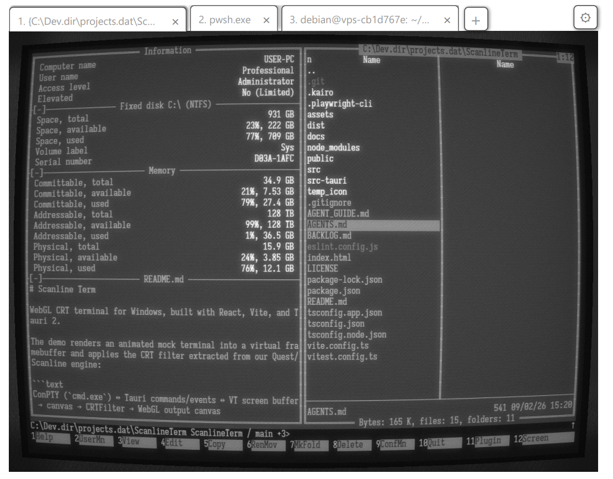
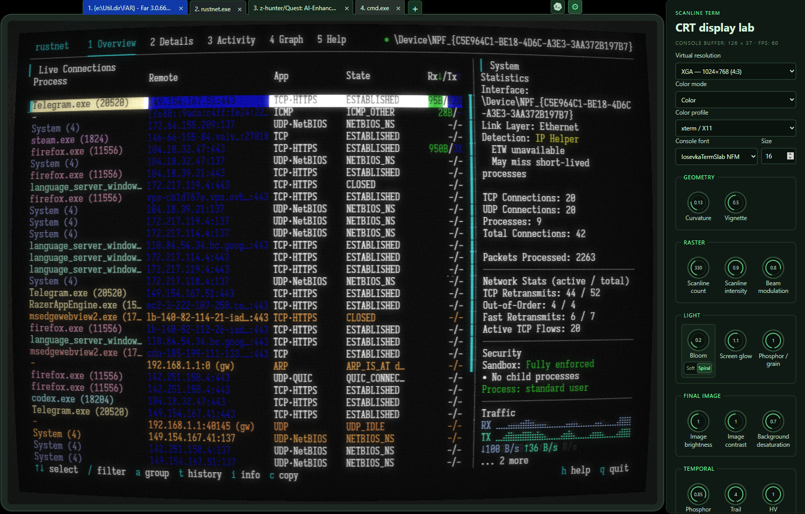

# Scanline Term

[](https://github.com/z-hunter/Scanline-Term/releases)
[](https://github.com/z-hunter/Scanline-Term)
[](https://tauri.app)
[](LICENSE)


**Scanline Term** is a "retro-futuristic" Windows terminal emulator that renders live console sessions through a physically-modelled WebGL CRT simulation pipeline.

Combining the raw nostalgia of 1980s cathode-ray tube monitors with modern power-user capabilities — multi-tab ConPTY sessions, an embedded keyboard-centric web browser, a Quake-style console global hotkey, and a context-aware AI terminal assistant — Scanline Term brings the golden era of computing straight into your modern developer workflow.

---

## Why Scanline Term?

### 1. Authentic CRT Physics

Scanline Term features a custom multi-pass WebGL shader pipeline extracted from our [*Scanline* game engine](https://github.com/z-hunter/Quest). It accurately simulates physical CRT phenomena:

* **Sinc-integrated Fourier scanlines** with dynamic electron beam modulation.
* **Phosphor persistence & ghosting trails** with ping-pong framebuffers and adjustable decay rates.
* **Multi-pass bloom & phosphor halation** (soft and spiral diffusion algorithms).
* **Physical glass distortion**: adjustable spherical barrel curvature, corner vignetting, and bezel ambient glow.
* **Hardware breathing & electrical fluctuations**: HV deflection breathing under heavy load, anti-moiré filtering, and phosphor grain/noise.



### 2. Keyboard-First Multitasking & Embedded WebView Browser

Keep your hands on the keyboard and stay in the zone:

* **Built-in WebView2 Browser Tabs**: Open documentation, API references, or web tools right alongside your terminal (`Menu + B` or pass URLs via CLI).
* **Fast Tab Switching**: Jump between multiple live console sessions and browser tabs instantly using `Menu + 1...9`.

### 3. Native Windows ConPTY Engine

Built specifically for Windows with Rust and native APIs:

* **ConPTY Backend**: Direct integration via `conpty-oxide` with bundled Windows ConPTY binaries.
* **Win32 Input Mode**: Full support for Win32 Console Input Mode (`?9001h`), function keys, numpad application modes, and full mouse tracking (SGR 1006, drag, and any-event).



### 4. Quake-Style Global Hotkey

Summon Scanline Term from anywhere in Windows with a single keystroke. When you're done, press `Win + ~` again to tuck it away without disrupting your active window layout.

### 5. AI Terminal Assistant

Connect any terminal session to an embedded Codex AI assistant (`Menu + A`). The operator can see the terminal session and safely execute commands in your tab with human-in-the-loop confirmation.

> **Note**: To use the AI Terminal Assistant, [Codex CLI](https://github.com/openai/codex) (version `0.152.1` or newer) must be installed on your system and available on your `PATH`.

### 6. Ultra-Lightweight & Fast

Scanline Term is built on **Tauri 2 + Rust + WebGL**. The production installer is only **~5.4 MB**, launches instantly, and stays lightweight on system resources.
Scanline Term is built on **Tauri 2 + Rust + WebGL**. The production installer is only **~5.4 MB**, launches instantly, and stays lightweight on system resources.

---

## Display Profiles & Virtual Resolutions

Scanline Term includes a real-time **CRT Display Lab** settings panel (`Menu + S`) with live sliders for every visual parameter.

* **Curated Color Profiles**: Classic DOS VGA, Windows Campbell, Amber Phosphor, Matrix Green Phosphor, Apple II, Commodore 64, IBM 3279, Cyberpunk Neon, B&W (~6500K White Phosphor), and Phosphor Blue.
* **Virtual Resolutions**: Toggle between authentic retro grid resolutions or pixel-sharp rendering:
  * **VGA** (640 × 480)
  * **SVGA** (800 × 600)
  * **XGA** (1024 × 768)
  * **Native** (Full resolution)

---

## Keyboard Shortcuts Cheat Sheet

> **Note**: The **`Menu`** key refers to the Application / Context Menu key (typically situated in the lower right keyboard row between `Alt`/`Win` and `Ctrl`).

| Shortcut | Action | Description |
| --- | --- | --- |
| **`Win + ~`** | Global Show/Hide | Summon or minimize Scanline Term from any Windows application |
| **`Alt + Enter`** | Fullscreen Toggle | Toggle distraction-free full-screen CRT mode |
| **`Menu + S`** | Settings Panel | Open / close the real-time CRT shader lab and display controls |
| **`Menu + A`** | AI Assistant Panel | Open / close the Codex AI assistant panel |
| **`Menu + N`** | New Terminal Tab | Spawn a new independent ConPTY shell session |
| **`Menu + B`** | New Browser Tab | Open a new embedded WebView2 browser tab and focus address bar |
| **`Menu + W`** | Close Tab | Close the active terminal session or browser tab |
| **`Menu + 1...9`** | Switch Tab | Switch directly to tab 1 through 9 |
| **`Menu + V`** | Paste | Paste clipboard text into the active shell |
| **`Menu + C`** | Copy Mode | Activate rectangular screen selection and copy mode |
| **`Menu + PgUp / PgDn`** | Scroll Buffer | Scroll the terminal screen and history buffer up or down |

### Browser Tab Keyboard Navigation

Embedded WebView2 browser tabs feature a keyboard-first, Vim-inspired navigation mode:

| Key | Action | Description |
| --- | --- | --- |
| **`j`** / **`k`** | Scroll Line | Scroll page down / up (64px) |
| **`d`** / **`u`** | Half-Page Scroll | Scroll half page down / up |
| **`gg`** / **`G`** | Top / Bottom | Jump to top (`gg`) or bottom (`G`) of the page |
| **`h`** / **`l`** (or **`Backspace`**) | History Navigation | Go back (`h` / `Backspace`) or forward (`l`) in page history |
| **`f`** | Link Hints | Show letter hints over interactive elements (links, buttons, inputs) to follow links without a mouse |
| **`o`** or **`F6`** | Address Bar | Open the address/search overlay bar |
| **`/`** | Find in Page | Search text on the current page |
| **`r`** | Reload | Reload the current page |
| **`i`** | Pass/Insert Mode | Enter pass-through mode to interact directly with web page keys |
| **`Esc`** | Normal Mode | Exit hints, address bar, or pass/insert mode back to normal navigation |
| **`Menu + ...`** | App Shortcuts | All main app shortcuts (`Menu + W`, `Menu + 1...9`, `Menu + B`, etc.) remain fully accessible within browser tabs |

---

## Installation

Download the latest pre-compiled Windows Installer (**MSI**) from the Releases page:

**[Download Scanline Term (Latest Release)](https://github.com/z-hunter/Scanline-Term/releases/latest)**

Run `Scanline.Term_0.1.0_x64_en-US.msi` to install. System requirements:

* Windows 10 (version 1809+) or Windows 11 (64-bit)
* [Microsoft Edge WebView2 Runtime](https://developer.microsoft.com/en-us/microsoft-edge/webview2/) (pre-installed on most modern Windows systems)
* *(Optional)* [Codex CLI](https://github.com/openai/codex) (version `0.152.1` or newer) on `PATH` if using the AI Terminal Assistant.

---

## Architecture

```text
┌─────────────────────────────────────────────────────────────┐
│                       Windows Desktop                       │
│     Global Hotkey (Win+~) ─── Native Child WebViews (URL)   │
└──────────────────────────────┬──────────────────────────────┘
                               │
┌──────────────────────────────▼──────────────────────────────┐
│                    Rust Backend (Tauri 2)                   │
│   ConPTY Lifecycle (conpty-oxide) ── Codex App-Server IPC   │
└──────────────────────────────┬──────────────────────────────┘
                               │ Tauri Commands & Events
┌──────────────────────────────▼──────────────────────────────┐
│                  Frontend UI (React 19)                     │
│  Tab Manager ── Headless xterm Buffer ── UI Controls        │
└──────────────────────────────┬──────────────────────────────┘
                               │ Canvas 2D Text Grid
┌──────────────────────────────▼──────────────────────────────┐
│                  CRTFilter (WebGL 1 Engine)                 │
│  Beam Modulation ── Scanlines ── Phosphor Persistence FBOs  │
│  Bloom Passes ── Screen Curvature ── Final Display Canvas   │
└─────────────────────────────────────────────────────────────┘
```

For in-depth architectural details, check our comprehensive documentation in [`docs/`](./docs/README.md):

* [Architecture & Data Flow](./docs/02-architecture.md)
* [Core Systems & Shaders](./docs/04-core-systems.md)
* [Design Decisions](./docs/05-design-decisions.md)
* [Codex Terminal Assistant Guide](./docs/10-ai-assistant.md)

---

## Building from Source

### Prerequisites

1. [Rust](https://rustup.rs/) (stable `x86_64-pc-windows-msvc` toolchain)
2. [Node.js](https://nodejs.org/) (v20+ recommended)
3. Visual Studio C++ Build Tools

### Development Workflow

```sh
# Clone the repository
git clone https://github.com/z-hunter/Scanline-Term.git
cd Scanline-Term

# Install frontend dependencies
npm install

# Start development in browser-only mode (simulated mock session for shader testing)
npm run dev

# Launch full native Tauri app with live ConPTY sessions
npm run tauri:dev

# Run frontend & backend test suites
npm test
cd src-tauri && cargo test

# Build production MSI installer
npm run tauri:build -- --bundles msi
```

---

## License

This project is licensed under the [MIT License](LICENSE).  
The WebGL `CRTFilter` originated in our *Quest/Scanline* project and is maintained here as a standalone module.

---

*Enjoy retro terminal computing! PRs, suggestions, and feedback are always welcome.*
