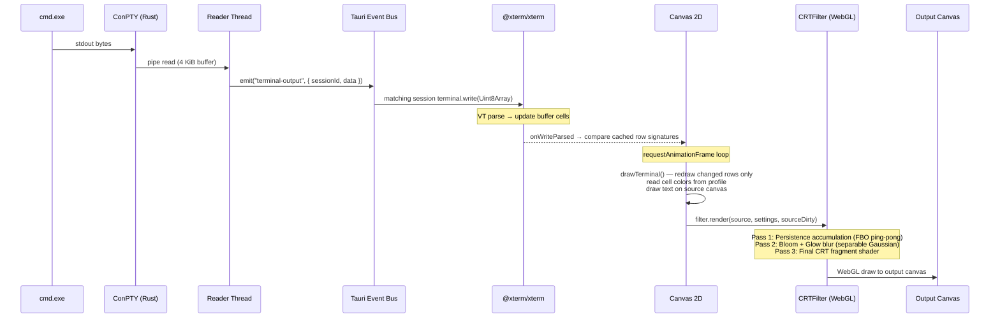
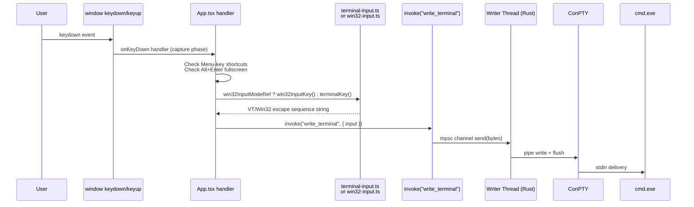
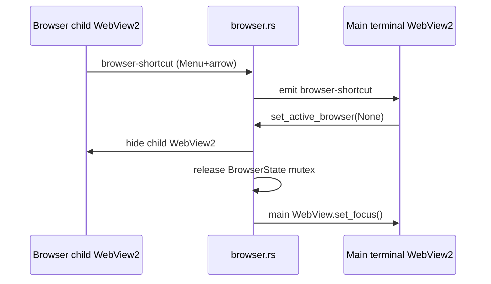
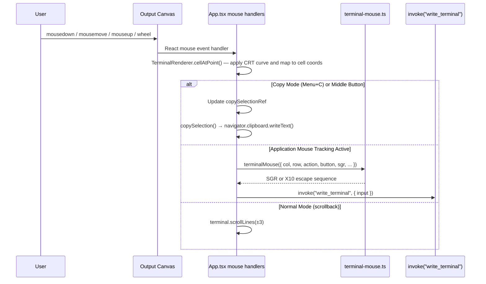
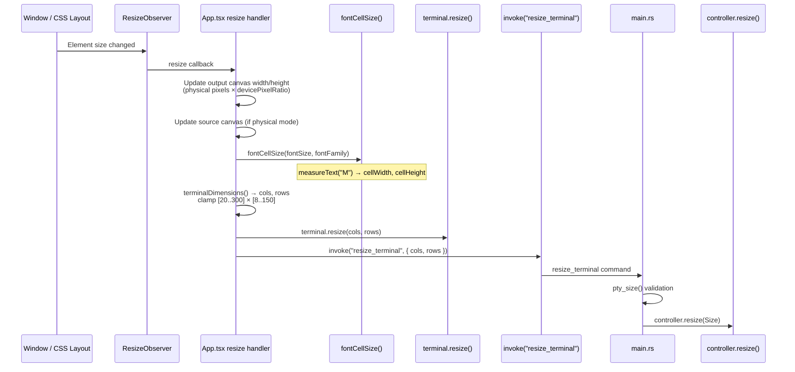

# 2 · Architecture

[← Overview](./01-overview.md) · [Index](./README.md) · [Codebase Guide →](./03-codebase-guide.md)

---

## Layer Diagram

```mermaid
graph TB
  subgraph "Windows OS"
    ConPTY["ConPTY DLLs<br/>(bundled x64)"]
    Shell["cmd.exe / PowerShell<br/>(child process)"]
    GDI["Win32 GDI<br/>(font enumeration)"]
  end

  subgraph "Rust / Tauri Process"
    Main["main.rs<br/>Tauri commands"]
    TermState["TerminalState<br/>(Mutex&lt;HashMap&lt;SessionId, TerminalSession&gt;&gt;)"]
    Reader["Output reader thread<br/>(4 KiB buffer loop)"]
    Writer["Input writer thread<br/>(mpsc channel receiver)"]
  end

  subgraph "WebView / Frontend (React + WebGL)"
    AppTsx["App.tsx<br/>React composition root"]
    TabsUi["ui/TerminalTabs.tsx<br/>tab strip"]
    HomeUi["ui/HomeDashboard.tsx<br/>local bookmark home"]
    UseTerminal["terminal/useTerminal.ts<br/>terminal lifecycle & input hook"]
    UseCRT["crt/useCRT.ts<br/>CRT animation & render hook"]
    TerminalSession["terminal/TerminalSession.ts<br/>PTY session coordinator"]
    TerminalRenderer["terminal/TerminalRenderer.ts<br/>Canvas 2D character grid"]
    Xterm["@xterm/xterm<br/>headless VT parser"]
    TermInput["terminal/terminal-input.ts<br/>VT key encoding"]
    Win32Input["win32-input.ts<br/>Win32 Input Mode encoding"]
    TermMouse["terminal/terminal-mouse.ts<br/>mouse event encoding"]
    ColorProfiles["terminal-color-profiles.ts<br/>palette definitions"]
    CRTFilter["CRTFilter.ts<br/>WebGL shader pipeline"]
    Settings["settings.ts<br/>localStorage persistence"]
    SourceCanvas["Source canvas<br/>(virtual resolution)"]
    OutputCanvas["Output canvas<br/>(physical pixels)"]
  end

  Shell <--> ConPTY
  ConPTY <--> Main
  GDI --> Main
  Main --> TermState
  TermState --> Writer
  Writer --> ConPTY
  ConPTY --> Reader
  Reader -->|"emit('terminal-output')"| TerminalSession
  Main -->|"emit('terminal-exit')"| TerminalSession

  TerminalSession -->|"invoke('start_terminal')"| Main
  TerminalSession -->|"invoke('write_terminal')"| Main
  TerminalSession -->|"invoke('resize_terminal')"| Main
  TerminalSession -->|"invoke('active_terminal_process')"| Main
  UseTerminal -->|"invoke('list_monospace_fonts')"| Main

  AppTsx --> UseTerminal
  AppTsx --> TabsUi
  AppTsx --> HomeUi
  AppTsx --> UseCRT
  AppTsx --> Settings

  UseTerminal --> TerminalSession
  UseTerminal --> TerminalRenderer
  UseTerminal --> TermInput
  UseTerminal --> Win32Input
  UseTerminal --> TermMouse
  UseTerminal --> ColorProfiles

  TerminalSession --> Xterm
  TerminalRenderer --> Xterm
  TerminalRenderer --> SourceCanvas

  UseCRT --> TerminalRenderer
  UseCRT --> CRTFilter
  SourceCanvas --> CRTFilter
  CRTFilter --> OutputCanvas
  HomeUi -->|"invoke load/save_home_config"| Main
  Main -->|"read/write"| HomeFile["AppConfig/home.json"]
```



## Execution Boundary

### Codex app-server experiment

Outbound `codex_send` and `codex_stop` calls carry the process `generation`; stale clients are rejected before they can affect a newer app-server process.

For a stale generation, `codex_send` returns an error, while `codex_stop` intentionally returns `Ok(())` without stopping the current process. A successful stale stop therefore does not confirm process termination.

The desktop process owns one hidden `codex app-server --stdio` child. It launches with an isolated app-local `CODEX_HOME` and neutral workspace, so personal Codex instructions, plugins, hooks and MCP configuration cannot affect terminal threads. `codex_start`, `codex_send`, and `codex_stop` carry JSON-RPC JSONL between it and the WebView; stdout, stderr, and exit are emitted with a process generation so stale events are ignored after restart. The WebView's `CodexClient` is the single protocol owner, initializes the experimental API, loads the account-visible model catalog, and then creates ephemeral threads. Model, effort and running-turn state are kept per terminal session in the WebView; they never cross the thread-to-session tool routing boundary. Each thread explicitly uses the neutral workspace, disables project instruction discovery and rejects a creation response that reports instruction sources. ChatGPT authentication is stored in the isolated app profile and is initiated through the panel when needed. See [Codex Terminal Assistant](./10-ai-assistant.md) for the protocol and safety boundary.

| Executes in **WebView** (JavaScript/TypeScript) | Executes in **Rust** (native process) |
|----|-----|
| React UI, settings panel, all event handlers | Tauri command handlers |
| xterm VT parsing and buffer management | ConPTY session lifecycle (spawn, I/O, kill) |
| Keyboard → VT/Win32 encoding | PTY input writer (mpsc channel → ConPTY pipe) |
| Mouse → SGR/X10 encoding | PTY output reader (pipe → Tauri event emission) |
| Canvas 2D terminal drawing | PTY resize (`controller.resize()`) |
| WebGL CRT shader rendering | Win32 GDI monospace font enumeration |
| `localStorage` settings persistence; signed update check/install | Bundled ConPTY DLL resolution; global `Win+~` registration and window show/hide; updater plugin |
| Copy/paste via `navigator.clipboard` | — |

## Data Flows

### Console Output → Screen



### Keyboard Input → Console



### Native Browser Tab Switching and Keyboard Focus

Browser tabs are separate native WebView2 child surfaces, not DOM elements in the terminal WebView. Consequently, a focused top-level Tauri window is not proof that the terminal WebView can receive keyboard events: WebView2 controller focus is a separate state.



`set_active_browser` must mirror its browser-entry focus call when it leaves a browser tab: after hiding children, and only after releasing `BrowserState`, it calls `app.get_webview("main").set_focus()`. Calling this controller-focus API unconditionally during startup or from a native `WM_SETFOCUS` handler can re-enter WebView2 focus processing and make the application unresponsive. The handoff is therefore guarded by a real active-browser → terminal transition. Window restoration uses Win32 `SetFocus` only on the first **visible direct** `WRY_WEBVIEW` child; recursive enumeration can select a hidden browser child created earlier.

`Menu+B` creates a browser tab in a local `home` page state. `HomeDashboard` is rendered in the main WebView while the native child WebView2 is absent. Selecting a validated HTTP(S) link changes the tab to `web`, calls `create_browser`, and then shows the child WebView2. Each native browser page reports a validated theme/background color through the `browser-color` event, so the corresponding tab updates its background and readable foreground color after home navigation or later in-page navigation. The home configuration is loaded and saved through Rust commands at `%APPDATA%\\com.zhunter.scanlineterm\\home.json`; the WebView never receives arbitrary filesystem permissions. In home state, `F` opens browser-style `asdfghjkl` hints for links, buttons, inputs, and editor controls; hint labels take precedence over custom link shortcuts, `Esc` closes the mode, and `F5` is consumed. Reload is explicit, and external sync conflicts are not merged.

The browser injects a small page-local script that bridges allowed `Menu+…` shortcuts through a rejected `scanline-term://shortcut/...` navigation; remote pages never get Tauri IPC. It also routes `target="_blank"` links and HTTP(S) `window.open()` calls into the current native browser tab: child WebView2 pop-up hosting is unreliable, while same-tab navigation preserves the external site's authentication flow. A standalone `Menu` press remains native browser input. The script suppresses only an orphan `ContextMenu` keyup that can arrive after a terminal → browser `Menu+arrow` transition, so that the combination does not open the browser context menu. A held `Menu` is not synthesized across native WebView boundaries: after browser → terminal switching, release and press `Menu` again before using another Menu shortcut.

### Mouse Input → Console



### Window Resize → Console Resize



### Command Line → Workspace Tab

On first launch, Rust parses the positional target and `-P` into a workspace launch request. An absolute `http` or `https` URL opens a browser tab; an existing `.htm`, `.html` or `.pdf` file is converted to a local `file://` browser target; a directory becomes the shell working directory, and other file or executable names become the terminal command. A blank browser tab starts in the local home dashboard; selecting a link promotes it to a native child WebView2 surface, which bypasses the WebGL CRT pipeline while retaining the screen frame's dimensions. A later URL or local-document invocation, including `-T`, is emitted as `browser-launch` to the running instance. Menu combinations from the native child are intercepted, bridged through a session-specific rejected navigation and local `browser-shortcut` event, then handled by the same frontend shortcut handler; remote pages receive no Tauri IPC.

## Concurrency Model

### Rust Side

```
┌─────────────────────────────────────┐
│           Main Tauri Thread         │
│  • Handles invoke commands          │
│  • Manages TerminalState (Mutex)    │
│  • start_terminal / write_terminal  │
│    / resize_terminal / active_terminal_process │
│    / close_terminal                 │
│    list_monospace_fonts             │
└──────────┬──────────┬───────────────┘
           │          │
    ┌──────▼──────┐ ┌─▼─────────────┐
    │Writer Thread│ │ Reader Thread  │
    │ mpsc recv   │ │ pipe read loop │
    │ → pipe write│ │ → emit event   │
    └─────────────┘ └────────────────┘
```

- **`TerminalState`** is a `Mutex<HashMap<SessionId, TerminalSession>>`, accessed by Tauri command handlers on the main thread. Each command carries the frontend-generated UUID for its target session.
- **Writer thread**: receives `Vec<u8>` from an `mpsc::Sender`, writes to the ConPTY input pipe. Blocks on `recv()`, terminates when the sender is dropped or the pipe errors.
- **Reader thread**: each session reads its ConPTY output pipe in a `[0; 4096]` buffer loop. Events carry `sessionId`, so the frontend routes them to the matching xterm buffer. On EOF or error, the reader removes only its own entry and emits `terminal-exit`.
- **`Drop` for `TerminalState`**: kills the child process to prevent orphaned console hosts.

### Frontend Side

- All rendering runs on the **main JavaScript thread** inside a `requestAnimationFrame` loop.
- xterm output is compared against cached row signatures. Only changed rows, plus the old/new cursor row, redraw; scroll, resize, settings, and selection redraw the whole source canvas.
- `ResizeObserver` triggers canvas and ConPTY resizes synchronously on the main thread.
- Keyboard/mouse handlers are registered on `window` in the **capture phase** to intercept events before any other handler.

---

*[Next: Codebase Guide →](./03-codebase-guide.md)*
