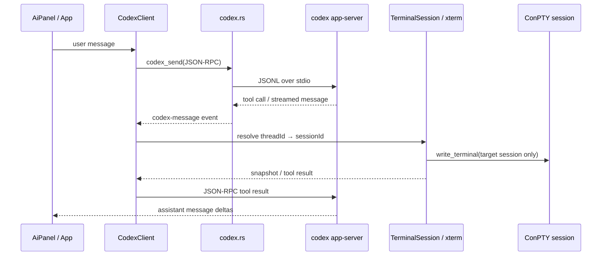

# 10 · Codex Terminal Assistant

[← Troubleshooting](./08-troubleshooting.md) · [Index](./README.md) · [Extension Guide →](./09-extension-guide.md)

---

## Purpose and boundary

The Codex terminal assistant is an experimental, Codex-only feature. It gives an agent a conversation and two session-bound terminal tools: it can inspect xterm's parsed screen/scrollback and enqueue keyboard input into the ConPTY session associated with that conversation.

The assistant does **not** execute the user's requested task in Codex's own shell. Its own Codex sandbox is read-only; the requested command runs only in the selected terminal tab. A thread-to-session map remains in the WebView, so no `sessionId` is ever exposed in model tool arguments.

This document describes the implementation as it exists now. It intentionally distinguishes implemented behaviour from future work in [Current limitations](#current-limitations).

## Components



| Layer | Files | Responsibility |
|---|---|---|
| Native process host | [`src-tauri/src/codex.rs`](../src-tauri/src/codex.rs) | Finds and version-checks Codex, owns one child `codex app-server --stdio`, frames JSONL and emits process events. |
| Protocol client | [`src/ai/CodexClient.ts`](../src/ai/CodexClient.ts) | Initializes app-server, assigns monotonic JSON-RPC IDs, resolves responses and routes server notifications. |
| Application integration | [`src/App.tsx`](../src/App.tsx) | Maps `threadId` to terminal tab, starts threads/turns, supplies snapshots, handles tool calls and streams chat messages. |
| Protocol subset | [`src/ai/protocol.ts`](../src/ai/protocol.ts) | Minimal JSON-RPC types used by the application; generated Codex protocol types are deliberately not imported. |
| Model selection | [`src/ai/modelSelection.ts`](../src/ai/modelSelection.ts) | Chooses the per-tab Codex model and supported reasoning effort, including the Luna/medium default and safe fallback. |
| Terminal bridge | [`src/terminal/TerminalSession.ts`](../src/terminal/TerminalSession.ts) | Builds snapshots, waits for xterm output, and encodes/enqueues automation input. |
| UI | [`src/ui/AiPanel.tsx`](../src/ui/AiPanel.tsx) | Per-active-tab chat view, composer, login button and developer debug console. |

## Startup, authentication and isolation

`codex_start` accepts only Codex CLI version `0.152.1` or later. It is idempotent while the existing child remains alive. It starts the server through `cmd.exe` and communicates over newline-delimited JSON-RPC on stdin/stdout. `taskkill /PID … /T /F` terminates its known process tree when the app stops.

The child does not inherit the developer's normal Codex workspace:

- `CODEX_HOME` is `%LOCALAPPDATA%\\com.zhunter.scanlineterm\\codex`.
- Its current directory and every Codex thread's `cwd` are the neutral `codex\\workspace` directory below that home.
- `project_doc_max_bytes: 0` disables project instruction-file discovery for the thread.
- The `thread/start` response is rejected if it reports `instructionSources`, or a `cwd` other than the neutral workspace.

This prevents a repository `AGENTS.md`, personal Codex plugin, hook or MCP configuration from directing the terminal agent. It also means app authentication is separate from `%USERPROFILE%\\.codex`: the user signs in once through **Sign in with ChatGPT**.

The client sends `initialize` with `experimentalApi: true`, then `initialized`, then `account/read`. For browser sign-in it calls `account/login/start`; the returned HTTPS URL is opened through `@tauri-apps/plugin-opener`, not `window.open`. `account/login/completed` triggers a fresh `account/read` and updates the panel.

After authentication the client calls `model/list` (following its cursor until exhausted) and shows only the account-visible models and their supported reasoning efforts. A new terminal tab prefers `gpt-5.6-luna` with `medium` effort. If that combination is unavailable, it uses the app-server default model and effort, then the first returned model as a last resort. The selection is local to the terminal tab and lasts until that tab closes; it is not persisted across app restarts.

The opener capability permits only `https://**` URLs in [`src-tauri/capabilities/default.json`](../src-tauri/capabilities/default.json).

## Thread and turn lifecycle

Threads are created lazily on the first user message for a terminal tab. `App.tsx` keeps the local map `sessionId → threadId`, while messages are stored under their `sessionId`. One app-server process can therefore serve more than one tab without any tool call being able to select a different destination.

Thread configuration is:

| Field | Value | Reason |
|---|---|---|
| `ephemeral` | `true` | Thread has no durable Codex history. |
| `approvalPolicy` | `never` | Intended for the sandbox experiment. |
| `sandbox` | `read-only` | Codex's own environment must not become the execution path. |
| `serviceName` | `scanline-term` | Identifies this client to app-server. |
| `baseInstructions` and `developerInstructions` | Terminal-assistant policy | Directs the model to use the terminal tools, observe output and ask before destructive work. |

The first turn includes the full xterm history; later turns include the latest 200 lines. Both are placed in the turn as explicitly untrusted terminal data. The full preserved scrollback remains available through `observe_terminal`.

The selected `model` is supplied when the thread is created and both `model` and `effort` are supplied on every `turn/start`. A selection change therefore affects the next turn in that tab without recreating the ephemeral thread. The active turn is never modified.

## Model commands

The composer accepts four local slash commands; none creates a Codex turn by itself:

| Command | Result |
|---|---|
| `/model` | Opens the account-visible model picker. |
| `/effort` | Opens the effort picker for the selected model. |
| `/status` | Adds a local message with connection, selection and thread state. |
| `/help` | Adds a local command reference. |

Typing `/` opens the same compact command palette used by the small model/effort indicator below the composer. Enter submits normal messages; there is intentionally no Send button. Opening the panel focuses the composer, while closing it returns focus to the active terminal. Unknown commands remain local and show a `/help` hint; they are never sent to the agent or terminal. The picker obtains its labels and effort descriptions from app-server rather than a hard-coded model list.

Agent-message deltas are accumulated only while they belong to the same app-server `itemId`. A later agent message, including one sent after a terminal action, is rendered as a separate assistant bubble. The active tab shows an animated working indicator until its own turn completes; a background turn never marks another tab as working. Sending a user message scrolls its chat to the end, while subsequent manual scrolling upward is preserved during streaming. The panel's debug console retains the latest 200 inbound/outbound JSON-RPC lines; it is diagnostic data and must not be treated as a user-facing audit log.

## Dynamic terminal tools

The current app-server version accepts a flat `dynamicTools` array. The model-facing names are `observe_terminal` and `send_terminal_input`; the assistant policy refers to them as the Scanline terminal tools. Calls that use an unexpected namespace or name are rejected.

### `observe_terminal`

Arguments:

| Argument | Meaning |
|---|---|
| `history` | `recent` (default, last 200 lines) or `full` (all preserved xterm scrollback). |
| `afterSequence` | If absent, return a snapshot immediately. If supplied, wait for output newer than this sequence. |
| `quietMs` | Required silence before completing a wait; clamped to 0–5,000 ms, default 400 ms. |
| `timeoutMs` | Total wait timeout; clamped to 1–60,000 ms, default 60,000 ms. |

`TerminalSnapshot` contains terminal status, title, direct-child process name, columns/rows, active normal/alternate buffer, monotonic xterm-output sequence, cursor coordinates, viewport position, first returned absolute line number, and trimmed lines. Right-side whitespace is removed; left indentation is preserved. When the tab exits while waiting, the call fails rather than claiming a timeout.

### `send_terminal_input`

Accepted action forms:

```ts
{ kind: "text", text: string, submit?: boolean }
{ kind: "key", key: string, ctrl?: boolean, alt?: boolean, shift?: boolean }
```

Text is limited to 64 KiB. `submit: true` appends `\r` in the same queued write. A named key is encoded using the tab's active mode: existing VT encoding for standard terminals, or Win32 key-down plus key-up records when ConPTY has enabled Win32 Input Mode (`?9001h`). The frontend uses the existing `write_terminal` command, whose Rust-side sender queues input before the invoke resolves.

## Safety model

The boundary is deliberately layered:

1. The model receives only a thread-local tool vocabulary; it has no session ID argument to alter.
2. The WebView resolves `threadId → sessionId` and dispatches to that `TerminalSession` only.
3. The Codex process has its own neutral home/workspace and a read-only sandbox.
4. Instructions require terminal output to be treated as untrusted data, require observed evidence before success claims, and prohibit destructive actions without explicit user consent.
5. The tool handler rejects unavailable sessions, unexpected namespaces and unknown tools.

This is an experiment, not a general security boundary: the terminal session itself may have the user's privileges. Do not broaden the assistant's tools or relax isolation without a deliberate security review.

## Failure handling and diagnostics

| Symptom | Expected behaviour / first check |
|---|---|
| CLI missing or old | `codex_start` reports that Codex must be present on `PATH` and be at least 0.152.1. |
| App-server EOF | `codex-exit` causes pending requests to fail with `Codex app-server disconnected`. |
| Sign-in button appears inert | Inspect Debug console for an `authUrl`; the opener capability and `tauri-plugin-opener` registration must be present. |
| Login cancelled | `account/login/completed` reports failure; start a new login rather than reusing an expired URL. |
| Unexpected instruction source | Thread creation fails closed. Inspect its result and the app-local `CODEX_HOME`; do not suppress the guard. |
| Tool receives no output | Compare the snapshot `sequence`, then use `afterSequence` with a bounded timeout. A timeout means the process may still be running; it is not permission to send Ctrl+C. |

## Current limitations

The following are not implemented yet and must not be documented as guarantees:

- Stop sends `turn/interrupt` for the active thread turn and rejects any tool call that arrives for that interrupted turn. It does not terminate a program already running in the terminal; the user can still send Ctrl+C when that is desired.
- `inputLocked` exists in terminal state but is not wired to block human keyboard input while a turn runs.
- Closing a terminal tab does not yet interrupt and explicitly delete/archive its Codex thread.
- Debug output contains JSON-RPC messages only; `codex-stderr` is not currently subscribed in `CodexClient`.
- There is no provider abstraction, chat persistence, MCP bridge, mouse automation or policy engine. Model and effort choices are ephemeral, per-tab controls only.

When implementing any item above, update this document, [`docs/02-architecture.md`](./02-architecture.md), [`docs/04-core-systems.md`](./04-core-systems.md), [`docs/07-testing.md`](./07-testing.md), and the root [`AGENT_GUIDE.md`](../AGENT_GUIDE.md).

## Developer validation

At minimum run:

```sh
npm test
npm run lint
npm run build
cd src-tauri && cargo test
```

Then use `npm run tauri:dev` on Windows to verify one browser login, a terminal observation, a submitted text command, a named key in a TUI, and tab switching while a conversation exists. Confirm in the debug console that `initialize.result.codexHome` is app-local and that `thread/start` reports the isolated workspace with no instruction sources.
